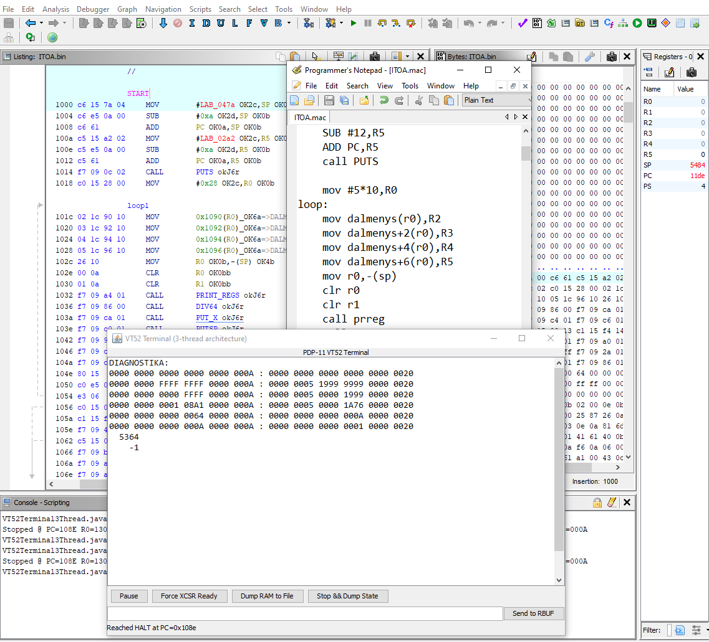

## PDP-11 for Ghidra

A Ghidra processor module that brings the PDP-11 architecture into the modern reverse-engineering workflow. It defines the instruction set, addressing modes, and Sleigh semantics, enabling both static disassembly and interactive emulation inside Ghidra.

The module is still under development, but it already runs several original DEC diagnostic tapes step-by-step and successfully completes the CPU tests. This provides a strong baseline for correctness of the core instruction set and flag behavior.

## What You Can Do Today

- Disassemble PDP-11 binaries with proper operand decoding
- Explore instruction behavior through Sleigh semantics
- Step through execution using Ghidra’s built-in p-code emulator
- Inspect registers, flags, and control flow interactively
- Run DEC diagnostics to validate CPU behavior

## What’s Still Missing

- Unimplemented or partially implemented instructions
- Floating-point and optional extensions
- More accurate emulation of edge cases
- Peripheral and system-level modeling
- Additional documentation and examples

## Installation

1. Clone this repository into your Ghidra installation under Ghidra/Processors
2. Build the extension using the provided Gradle configuration (see makefile)
3. Start Ghidra and enable the PDP-11 language
4. Load a PDP-11 binary or DEC diagnostic tape image and begin exploring

## DEC Diagnostics

Several original DEC diagnostic tapes have been tested. They currently:
- Run without errors
- Validate core CPU behavior
- Confirm correct flag and register semantics
- Provide a reliable baseline for future improvements

## Contributing

Bug reports, test cases, documentation improvements, and pull requests are appreciated. If you have PDP-11 binaries, diagnostics, or hardware knowledge, your input is especially valuable.

## License

MIT License.

Processor language module for DEC PDP11 CPU.

As for 2026.07.20:

## Debugger passed:
- "AC-E664G-MC_CXCPAG0-Processor-test_Sep78"
- D0AA-PB (branch)
- D0BA-PB (conditional branch)
- D0CA-PB (unary)
- D0DA-PB (unary and binary)
- D0EA-PB (rotary/shift)
- D0FA-PB (compare equality)
- D0GA-PB (compare non equality)
- D0HA-PB (move)
- D0IA-PB (bis, bix, bit)
- D0JA-PB (ADD)
- D0KA-PB (SUBTRACT)
- D0LA-PB (JMP)
- D0MA-PB (JSR/CALL/RETURN/RTI)
- D0OA-PB (NEW NUMBER - DZQKA. T15 Instruction Exerciser)?

## Debuger Failed:
- D0NA-PB (NEW NUMBER - DAKAA. TRAP/EMT. PDP-11/20, 11/05, 11/10) - possible wrong tape for this CPU.

*Note: extra symbols near disassembled mnemonics are for debug purposes.*

&copy;2026 by Vabolis. https://www.vabolis.lt

